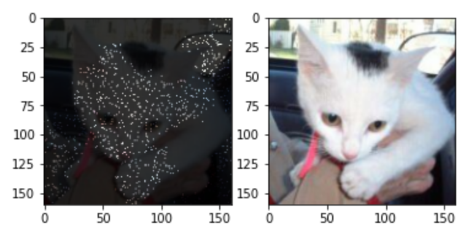
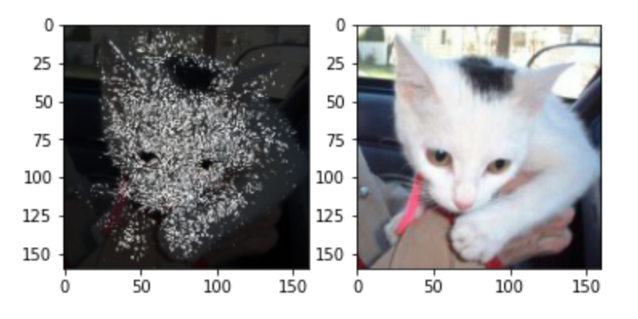

# explainable_ai
A consolidated Python library which works with models of the user’s choice as part of their training or prediction functions to explain predictions of both text based and image based deep network models specific to classification.
We hope to help remove the black box element from Deep Learning models built to scale with high levels of accuracy by explaining their predictions.

## Motivation

### Explainability

The explainability problem is well known in Machine Learning. Deep Neural Networks helps us solve complex problems, usually as a “Black Box” that makes intelligent decisions. But we always lack clarity about how our model reaches a particular endpoint i.e. What are the key contributing factors (or input features)? 
In some application spaces like medicine, this lack of explainability is not just inconvenient, but unacceptable. We need more explanations about what was learnt for predictions.


### Lack of Consolidated Resources
Although there exist several methods to explain a model, their current implementations cannot be applied to all types of models and are scattered across libraries. 
Many explanation techniques have been created and are easily available for image models (especially CNNs) and the work around textual models is pretty scarce. 
We aim to create a consolidated model explanation library (in Python) for images and textual models (specific to classification) which is easily import-able and compatible with Tensorflow/Keras.

## Explaination Methods Covered


### Anchors

This is a **black box** technique that assumes one cannot access the weights of the model. An anchor explanation is a rule that sufficiently “anchors” the prediction locally – such that changes to the rest of the feature values of the instance do not matter.
Anchors uses “local region” to learn how to explain the model. The four main components of the approach we follow are:

1.	We first generate new explanation candidates.
2.	Candidate rules are to be compared to see which rule explains the best. To this end, perturbations that match the currently observed rule are created and evaluated using precision - which states how well the rule describes the instance to be explained.
3.	We take more samples in case there is no statistical confidence yet or in the event that the candidate exceeds the predetermined threshold.
4.	All of the above components are assembled in a beam search, which is a graph search algorithm and a variant of the breadth-first algorithm. It carries the best candidates of each round over to the next one.

We have used the same implementation approach text and images

### Integrated Gradients

This is a **white box** explanation method that aAccesses the weights learned by the model and tries to use these weights to better understand what input features activated the weights while the model computed the results.
Integrated Gradients assumes less bias in model explanation as it accesses the weights learnt. The algorithm is as follows:

1.	The gradients w.r.t model are computed, using the standard gradient operator, at set intervals on the interpolation path between input and it’s baseline input (uninformative input).
2.	We then find the integrated gradients for the input. The gradients computed at different intervals of the interpolation path form the integrated gradients by cumulating the gradients along the path.
3.	Multiplying the difference in the image and the baseline with the computed integrated gradients tells us exactly what pixels were activated and contributed to the classification.

Both text and image data follow a similar implementation with the exception of the baseline input used (zero word embedding vector for text or black image for images).

### Counterfactual Explainations

This is an **adversarial method** that uses perturbations in input to “deceive” a model to predict a contrary result. The amount of perturbations give us an idea about the feature importance. 
A counterfactual explanation of a prediction describes the smallest change to the feature values that causes the prediction to flip a predefined output. The counterfactual example must fulfil the following criteria:

1.	A counterfactual instance produces the predefined prediction as closely as possible.
2.	A counterfactual should be very similar to the instance regarding feature values.
3.	A counterfactual instance should have feature values that are likely/realistic.

While implementing counterfactual explanations for images and text, we create counterfactual examples relative to an input baseline. For text-based models we have also extended the creation of counterfactual examples using antonyms.

---

## Installation

The library is installable in any python script/notebook as
```
git clone https://github.com/kartikparnami/explainable_ai.git
```

We plan to support PyPi-based pip installation in the future.

## Usage

To explain any instance, first import the explainer from the library as follows:

```
from explainable_ai.(anchor/counterfactual/integrated_gradients).<method_name>_(image/text) import <class_name>

# Example:
from explainable_ai.anchor.anchor_image import AnchorImage
from explainable_ai.counterfactual.lc_text import LimeCounterfactualText
```

Initialize the explanation instance (works fine with default parameters in most cases):

```
explainer = XXXExplainer()

# Example:
explainer = AnchorImage()
explainer = LimeCounterfactualText()
```

Now use the explainer instance to explain predictions:
```
explanation = explainer.explain_instance(instance, model/predict_fn, ...)

# Example:
explanation = anchor_image_explainer.explain(image, predict_fn)
plt.imshow(explanation)

explanation = lime_counterfactual_text_explainer.explain(text, predict_fn)
explanation
```

Note: Integrated gradients technique requires to pass the TensorFlow model itself as it is a whitebos technique which works by accessing the model weights.

## Examples

Examples of usage of each of these methods can be found in examples/ folder in jupyter notebooks.

#### Sample image explanations:

##### Anchor Image Explanation


##### Counterfactual Image Explanation


##### Integrated Gradients Image Explanation


#### Sample text explanations:

##### Anchor Text Explanation


##### Counterfactual Text Explanation


##### Integrated Gradients Text Explanation

